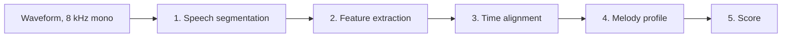
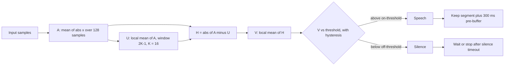
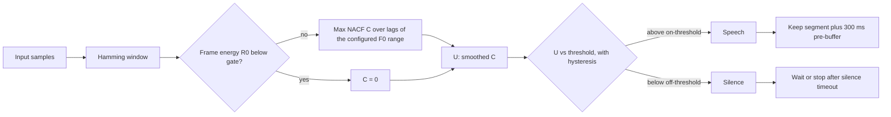
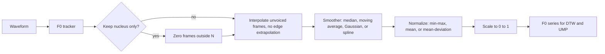
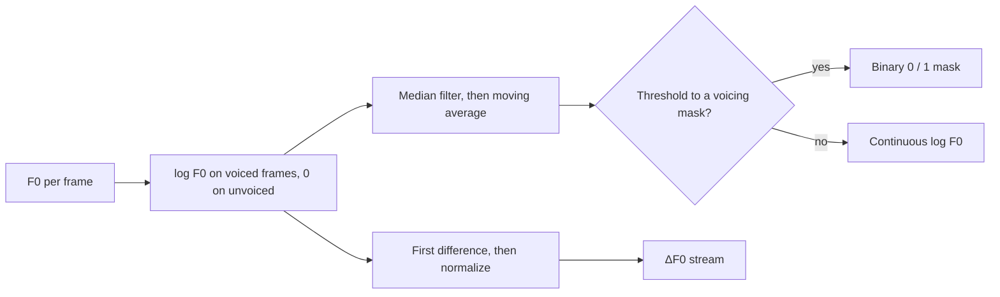
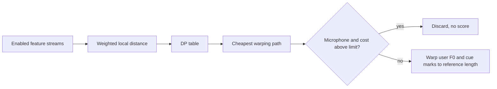
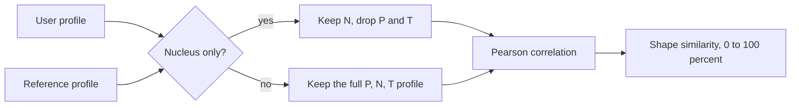
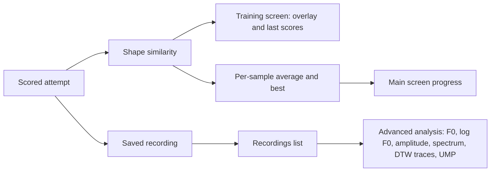

# How IntonTrainer processes audio

Russian version: [data_flow_ru.md](data_flow_ru.md).

This note is for readers familiar with speech signal processing. It describes the transformations applied to the reference sample and to each user attempt, from the waveform to the similarity score. Typical default parameters are given; all of them can be changed in Settings.

Capture is **8 kHz, mono, 16-bit PCM**.

---

## End-to-end pipeline

The same chain runs on the reference (once, when the sample is opened) and on every user recording.

Each stage is broken down in its own section below. Three points are worth stating up front:

- Only streams enabled in Settings enter the alignment stage.
- The training score is computed from the two melody profiles, **not** from the alignment cost.
- Alignment cost acts as a **gate** on microphone takes: if the warp is too expensive, the attempt is discarded and never scored.

---

## 1. Speech segmentation (VAD)

Recording is not cut at a fixed length. The detector finds speech onset, then offset after a silence timeout. A **300 ms pre-buffer** is kept so the first syllable is not clipped. Takes shorter than a fraction of the reference duration (default 100%) are rejected.

Frames: **128 samples**, hop **64 samples** (8 ms at 8 kHz). Decision uses hysteresis (separate on/off thresholds).

### Energy detector

Calibration records background noise and sets the energy threshold from that distribution.

### Autocorrelation detector

NACF is `C(lag) = R(lag) / R(0)`. The lag search runs from `fs / F0max` to `fs / F0min` (typical F0 band 80–300 Hz, so lags 27–100 at 8 kHz).

### Combining the two

| Mode | Speech if |
|------|-----------|
| Energy | energy detector is on |
| Autocorrelation | autocorrelation detector is on |
| Hybrid AND | both on |
| Hybrid OR | either on |

---

## 2. Feature extraction

The speech segment is turned into several parallel time series. Disabled or missing streams are simply omitted downstream.

| Stream | Derived from | Feeds |
|--------|--------------|-------|
| F0 contour | pitch tracker, gap-filled and smoothed | alignment **and** melody profile |
| log F0 | log of F0, median + moving average | alignment, voicing mask |
| ΔF0 | first difference of log F0 | alignment |
| Amplitude envelope | short-time mean absolute amplitude | alignment |
| ΔA | first difference of the envelope | alignment |
| Spectrum | WORLD magnitude spectrum | alignment |
| Cepstrum | FFT cepstrum | alignment |

Only the F0 contour reaches the score. Every other stream exists to make the time alignment more robust.

### Pitch (F0)

Default tracker: **RAPT** (SWIPE, REAPER, DIO, Harvest are available). Typical search band **80–500 Hz**.

- Unvoiced frames (F0 = 0) are filled by the chosen interpolator (default **linear**). Leading and trailing unvoiced runs are left empty so the contour is not extrapolated.
- Default smoother: **median**, window 16.
- Default normalization: **min–max**, then affine map to `0…1`.
- Optional **nucleus mask**: frames outside N (the main tone region marked in the sample) are zeroed *before* interpolation and smoothing.

### Log pitch and its derivative

Two more series branch off the raw tracker output, independently of the contour above.

The median plus moving-average pair suppresses octave jumps. Note that ΔF0 branches off *before* that smoothing, so it is the difference of the raw log contour. When the binary mask is used, it also acts as a weighting mask inside the alignment.

### Amplitude

Short-time **mean absolute amplitude** (not RMS): window 1024 samples, hop 512, centered on each hop. Then optional smoothing (default **median**) and scale to `0…1`. **ΔA** is the first difference of that envelope.

### Spectrum and cepstrum

- Magnitude spectrum via **WORLD**, FFT length typically 1024, with optional F0 refinement from the same tracker.
- **FFT cepstrum**, typical order 25.
- Each frame is a vector; both streams are scaled to `0…1` over the whole recording.

These are 2-D features in DTW (one vector per frame). They improve alignment when pitch alone is ambiguous; they do not define the training score.

---

## 3. Time alignment (DTW)

User and reference usually differ in duration. A **constrained multi-stream DTW** finds a warp from user time to reference time.

Enabled streams are stacked. Each has its own weight (default 1). Per-frame distance is a weighted mix of **normalized Euclidean** distances (1-D streams) or vector Euclidean distances (spectrum / cepstrum). Recurrence:

- **match** — both time axes advance  
- **insertion** — user advances, reference holds  
- **deletion** — reference advances, user holds  

Each move has a cost coefficient (defaults 1). If the log-F0 mask is on, unvoiced frames are down-weighted.

Streams of different lengths are linearly resampled onto a common frame axis before the DP table is filled.

Where the path is allowed to begin and end depends on the boundary mode:

- **Free start/end** (default): the path may start at any user frame and stop at the best end — substring search, useful when the recording is longer than the sample.
- **Fixed start/end**: full recording vs full sample (global morph). Better when lengths are comparable.

**Distance gate (microphone only):** if the normalized path cost exceeds a limit (default 100), the take is dropped. Files opened from Recordings always go through. Setting the limit to 0 disables the gate.

---

## 4. Unified melody profile (UMP)

After warping, F0 is still the original phrase length. UMP puts both contours onto a **fixed structural grid** so they can be correlated.

Each sample carries cue regions:

| Region | Role | Grid length |
|--------|------|-------------|
| P — pre-nucleus | Approach to the tone | 50 points |
| N — nucleus | Main tone gesture | 100 points |
| T — post-nucleus | Release / ending | 50 points |

A P or T marker sitting between two N regions is split into a T + P pair so adjacent nuclei stay separated.

The reference profile is built by exactly the same procedure, from the *unwarped* reference F0.

---

## 5. Score

Both profiles are the same length, so they can be compared point by point.

Let `u` and `r` be the two UMP vectors, and `p` the Pearson correlation between them.

| Quantity | Definition |
|----------|------------|
| Shape similarity (the training score) | `max(0, p) * 100` — anti-correlated shapes score 0, never a negative number |
| Range of each profile | `(max - min) / F0 band * 100`, clamped at 100 |
| Range similarity | `100 - abs(range_r - range_u)`, clamped at 0 |

The number on the training screen is **shape similarity**. Range figures are diagnostic.

---

## Training modes (when the chain runs)

The processing above is the same in every mode. Modes only change **when** the microphone opens and closes.

| Mode | Selected by | Capture |
|------|-------------|---------|
| Automatic | auto-stop on, guided off | Continuous listen → speech → silence timeout → process → listen again |
| Guided | auto-stop on, guided on | Play reference → short pause → listen window → process (timeout returns to idle, no score) |
| Manual | auto-stop off | User starts and stops recording with the record button |

---

## Where you see the results

Advanced analysis is the same pipeline with more of the intermediate series drawn. You do not need to change filters for ordinary practice; the defaults (RAPT, median F0, min–max, free-endpoint DTW, full P/N/T UMP) are the intended operating point.
