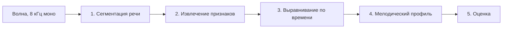
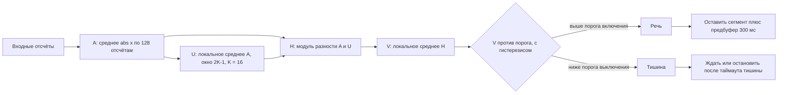
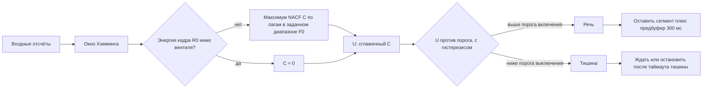
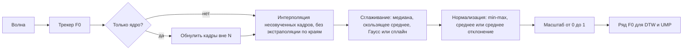
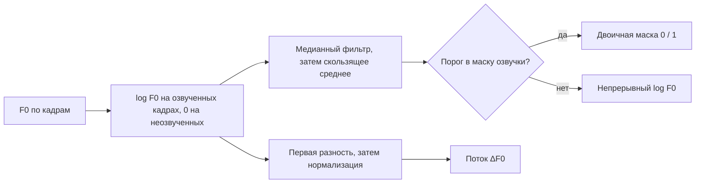
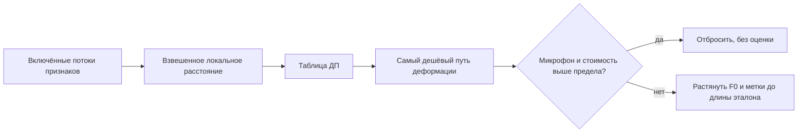
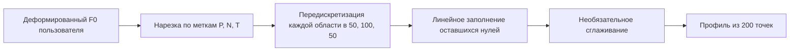
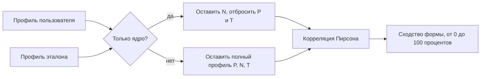
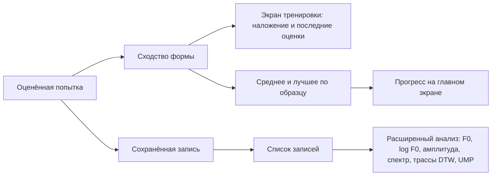

# Как IntonTrainer обрабатывает звук

Английская версия: [data_flow.md](data_flow.md).

Заметка для читателей, знакомых с обработкой речевого сигнала. Описаны преобразования эталона и каждой попытки пользователя — от волны до оценки сходства. Указаны типичные значения по умолчанию; все они меняются в Настройках.

Захват: **8 кГц, моно, 16 бит PCM**.

---

## Конвейер целиком

Одна и та же цепочка применяется к эталону (один раз, когда образец открыт) и к каждой записи пользователя.

Каждый этап разобран в своём разделе ниже. Три момента стоит проговорить сразу:

- В выравнивание попадают только включённые в Настройках потоки.
- Оценка тренировки считается по двум мелодическим профилям, а **не** по стоимости выравнивания.
- Стоимость выравнивания работает как **фильтр** записей с микрофона: слишком дорогая деформация — попытка отбрасывается и не оценивается.

---

## 1. Сегментация речи (VAD)

Запись не режется фиксированной длиной. Детектор находит начало речи и конец после таймаута тишины. Сохраняется **предбуфер 300 мс**, чтобы не обрезать первый слог. Попытки короче заданной доли эталона (по умолчанию 100%) отвергаются.

Кадры: **128 отсчётов**, шаг **64 отсчёта** (8 мс при 8 кГц). Решение с гистерезисом (разные пороги включения и выключения).

### Энергетический детектор

Калибровка записывает фоновый шум и выставляет энергетический порог по этой выборке.

### Автокорреляционный детектор

NACF: `C(lag) = R(lag) / R(0)`. Поиск лага идёт от `fs / F0max` до `fs / F0min` (типичная полоса F0 80–300 Гц, то есть лаги 27–100 при 8 кГц).

### Совмещение двух детекторов

| Режим | Речь, если |
|------|-----------|
| По энергии | сработал энергетический детектор |
| По автокорреляции | сработал автокорреляционный детектор |
| Гибрид И | оба |
| Гибрид ИЛИ | любой из двух |

---

## 2. Извлечение признаков

Речевой сегмент превращается в несколько параллельных временных рядов. Выключенные или отсутствующие потоки просто не идут дальше.

| Поток | Из чего получен | Куда идёт |
|-------|-----------------|-----------|
| Контур F0 | трекер высоты тона, с заполнением пропусков и сглаживанием | выравнивание **и** мелодический профиль |
| log F0 | логарифм F0, медиана + скользящее среднее | выравнивание, маска озвучки |
| ΔF0 | первая разность log F0 | выравнивание |
| Огибающая амплитуды | кратковременная средняя абсолютная амплитуда | выравнивание |
| ΔA | первая разность огибающей | выравнивание |
| Спектр | амплитудный спектр WORLD | выравнивание |
| Кепстр | FFT-кепстр | выравнивание |

До оценки доходит только контур F0. Все остальные потоки нужны, чтобы выравнивание по времени было устойчивее.

### Высота тона (F0)

Трекер по умолчанию: **RAPT** (доступны SWIPE, REAPER, DIO, Harvest). Типичная полоса поиска **80–500 Гц**.

- Неозвученные кадры (F0 = 0) заполняются выбранным интерполятором (по умолчанию **линейным**). Начальные и конечные неозвученные участки не трогают, чтобы не экстраполировать контур.
- Сглаживание по умолчанию: **медиана**, окно 16.
- Нормализация по умолчанию: **min–max**, затем аффинное отображение в `0…1`.
- Необязательная **маска ядра**: кадры вне N (основной тон, размеченный в образце) обнуляются *до* интерполяции и сглаживания.

### Логарифм высоты тона и его производная

Ещё два ряда ответвляются от сырого выхода трекера, независимо от контура выше.

Пара «медиана + скользящее среднее» подавляет октавные скачки. Обратите внимание: ΔF0 ответвляется *до* этого сглаживания, то есть это разность сырого логарифмического контура. Если включена двоичная маска, она работает ещё и как весовая маска внутри выравнивания.

### Амплитуда

Кратковременная **средняя абсолютная амплитуда** (не RMS): окно 1024 отсчёта, шаг 512, окно центрировано на шаге. Затем сглаживание (по умолчанию **медиана**) и масштаб `0…1`. **ΔA** — первая разность этой огибающей.

### Спектр и кепстр

- Амплитудный спектр **WORLD**, типичная длина БПФ 1024, с необязательным уточнением F0 тем же трекером.
- **FFT-кепстр**, типичный порядок 25.
- Каждый кадр — вектор; оба потока масштабируются в `0…1` по всей записи.

В DTW это двумерные признаки (вектор на кадр). Они улучшают выравнивание, когда одного F0 мало; оценку тренировки они не определяют.

---

## 3. Выравнивание по времени (DTW)

Длительности пользователя и эталона обычно разные. **Ограниченный многопотоковый DTW** ищет деформацию времени пользователя к времени эталона.

Включённые потоки складываются. У каждого свой вес (по умолчанию 1). Покадровая мера — взвешенная смесь **нормированных евклидовых** расстояний (одномерные потоки) или векторных евклидовых (спектр / кепстр). Рекуррентность:

- **совпадение** — обе оси времени шагают вперёд  
- **вставка** — шагает пользователь, эталон стоит  
- **удаление** — шагает эталон, пользователь стоит  

У каждого хода свой коэффициент стоимости (по умолчанию 1). Если включена маска log-F0, неозвученные кадры ослабляются.

Потоки разной длины линейно приводятся к общей кадровой оси до заполнения таблицы ДП.

Где путь может начаться и закончиться, зависит от режима границ:

- **Свободные начало/конец** (по умолчанию): путь может начаться с любого кадра пользователя и оборваться на лучшем конце — поиск подстроки, удобно, если запись длиннее образца.
- **Фиксированные начало/конец**: вся запись против всего образца (глобальный морф). Удобно, когда длины сопоставимы.

**Порог расстояния (только микрофон):** если нормированная стоимость пути выше предела (по умолчанию 100), попытка отбрасывается. Файлы из Записей всегда проходят. Предел 0 отключает фильтр.

---

## 4. Единый мелодический профиль (UMP)

После деформации F0 всё ещё имеет длину исходной фразы. UMP кладёт оба контура на **фиксированную структурную сетку**, чтобы их можно было коррелировать.

У каждого образца есть области-метки:

| Область | Роль | Длина сетки |
|--------|------|-------------|
| P — пренуклеус | Подход к тону | 50 точек |
| N — нуклеус | Основной жест тона | 100 точек |
| T — постнуклеус | Спад / окончание | 50 точек |

Метка P или T между двумя N разрезается на пару T + P, чтобы соседние ядра не сливались.

Профиль эталона строится ровно той же процедурой, но из *недеформированного* F0 образца.

---

## 5. Оценка

Оба профиля одной длины, поэтому их можно сравнивать поточечно.

Пусть `u` и `r` — два вектора UMP, а `p` — корреляция Пирсона между ними.

| Величина | Определение |
|----------|------------|
| Сходство формы (оценка тренировки) | `max(0, p) * 100` — антикоррелированные формы дают 0, а не отрицательное число |
| Диапазон каждого профиля | `(max - min) / полоса F0 * 100`, с ограничением сверху на 100 |
| Сходство диапазонов | `100 - abs(диапазон_r - диапазон_u)`, с ограничением снизу на 0 |

Число на экране тренировки — **сходство формы**. Диапазоны — диагностика.

---

## Режимы тренировки (когда запускается цепочка)

Обработка выше одна и та же. Режимы меняют только **когда** открывается и закрывается микрофон.

| Режим | Когда включается | Захват |
|-------|------------------|--------|
| Автоматический | автостоп включён, подсказки выключены | Непрерывное слушание → речь → таймаут тишины → обработка → снова слушать |
| С подсказками | автостоп включён, подсказки включены | Эталон → короткая пауза → окно прослушивания → обработка (таймаут — в ожидание, без оценки) |
| Ручной | автостоп выключен | Пользователь сам стартует и стопит запись кнопкой записи |

---

## Где видны результаты

Расширенный анализ — та же цепочка, только нарисованы промежуточные ряды. Для обычной практики фильтры менять не нужно: рабочая точка по умолчанию — RAPT, медиана F0, min–max, DTW со свободными границами, полный UMP P/N/T.
