# Руководство пользователя - IntonTrainer 2-Ch

В этом руководстве объясняется, как использовать **IntonTrainer 2-Ch** на практике, ориентируясь на выполнение конкретных задач. В нем рассматривается, что делает приложение, как работает основной рабочий процесс, какие настройки можно безопасно изменять, а какие лучше оставить без изменений, если вам не приходится устранять конкретную проблему со звуком.

## 1. Что такое IntonTrainer 2-Ch

**IntonTrainer 2-Ch** - это настольное и Android-приложение для тренировки произношения тонов китайской речи с использованием эталонных аудио образцов. Настольную версию можно скачать на [intontrainer.by](https://intontrainer.by/#download-inton2-ch). Версия для Android опубликована в [Google Play](https://play.google.com/store/apps/details?id=by.intoncore.intontrainer2.zh).

В китайском языке принято выделять четыре основных тона:

- Первый тон (высокий и ровный): обозначается символом ¯ (напр., mā).
- Второй тон (восходящий): обозначается символом ˊ (напр., má).
- Третий тон (нисходяще-восходящий): обозначается символом ˇ (напр., mǎ).
- Четвёртый тон (резко нисходящий): обозначается символом ˋ (напр., mà).

Значение слова может изменяться в зависимости от используемого тона, например:

- 妈 (mā) - мать (первый тон).
- 麻 (má) - конопля (второй тон).
- 马 (mǎ) - лошадь (третий тон).
- 骂 (mà) - ругать (четвёртый тон).

Приложение предоставляет набор эталонных аудио шаблонов:

- 12 односложных китайских слов (фраз) с их семантическим значением для каждого из четырех тонов,
- наборы фраз, составленных из различных сочетаний этих слов,
- 40 аудио примеров слов и фраз, часто используемых в коммуникативной практике,
- 9 аудио примеров простых повседневных многословных фраз.

Приложение помогает вам:

- прослушать эталонную фразу (слово),
- записать свою попытку,
- сравнить ваш тональный контур с эталоном,
- просмотреть показатель сходства,
- вернуться к предыдущим аудиозаписям для анализа.

Вкратце, приложение предназначено для управляемой практики и самокоррекции на основе эталонных аудио образцов.

## 2. Основные возможности

**IntonTrainer 2-Ch** включает в себя следующие основные возможности:

### 2.1 Практика с эталонными образцами (паттернами)

Вы можете открыть образец фразы, прослушать эталонную запись и попытаться сопоставить ее мелодию (движение тона) со своим произношением.

### 2.2 Запись голоса непосредственно с микрофона

Приложение может воспринимать входной сигнал с микрофона в реальном времени и анализировать его, сравнивая с эталонным аудио файлом.

Для надёжных результатов используйте качественный микрофон — внешний или хороший встроенный микрофон ноутбука. Дешёвые или шумные микрофоны искажают контур высоты тона и делают процент сходства менее достоверным.

### 2.3 Автоматический детектор речи

Если включена функция автоматического запуска и остановки, приложение сможет определить, когда вы начинаете говорить, а также автоматически завершить запись.

### 2.4 Три различных режима тренинга

Доступные режимы тренинга:

- Автоматический режим
- Режим с подсказками
- Ручной режим

Выбор режима тренинга осуществляется пользователем в соответствии с рекомендациями, изложенными в [п. 5.4](#54-различия-между-режимами).

### 2.5 Сравнение аудио- и визуальных деталей

Приложение предоставляет возможность получить:

- отображение волновой формы,
- отображение контура высоты тона,
- диагностику амплитуды сигнала и спектра,
- отображение результата DTW (Dynamic Time Warping)-сопоставления,
- итоговый показатель сходства в процентах.

### 2.6 Просмотр сохраненных попыток

Вы можете открыть предыдущие записи и сравнить свой результат с интересующим вас образцом.

## 3. Типичный рабочий процесс

Обычная тренировочная сессия проходит в следующей последовательности:

1. Откройте приложение.
2. Перейдите на главный экран.
3. Начните тренинг.
4. Выберите категорию, а затем файл образца.
5. Прослушайте эталонный образец.
6. Попытайтесь произнести фразу (слово) выбранного образца.
7. Просмотрите сравнительные кривые движения тона и результат подобия кривых в процентах.
8. При необходимости повторите упражнение.

_Это рекомендуемый способ использования приложения для регулярной практики._

## 4. Основные экраны и их назначение

### 4.1 Главный экран

Главный экран - это отправная точка.

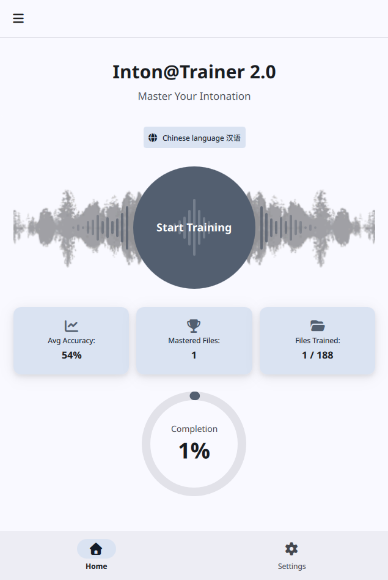

Он предоставляет информацию:

- об общем статусе,
- об изучаемом языке,
- о точке входа для начала тренинга,
- краткий обзор прогресса тренинга.

_Используйте этот экран, когда вы готовы начать новую тренировочную сессию._

### 4.2 Экран «Категории образцов»

На этом экране вы можете просматривать доступные папки с образцами.

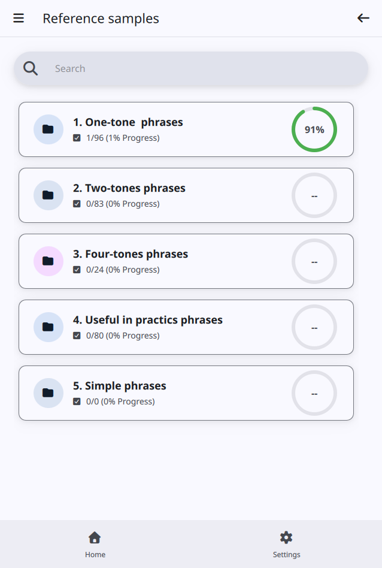

Используйте его для:

- поиска категории,
- открытия папки с записями образцов,
- перехода к списку файлов образцов.

### 4.3 Экран «Файлы образцов»

На этом экране отображается список фактических эталонных файлов `.wav` в выбранной категории.

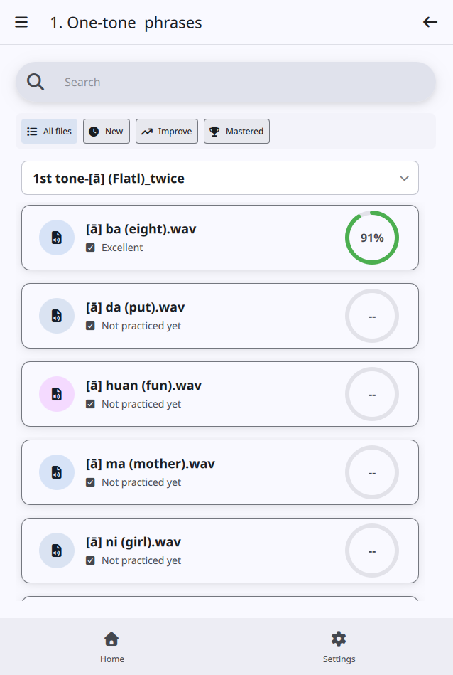

Вы можете:

- искать определенный файл,
- фильтровать по статусу,
- разворачивать или сворачивать группы аудиофайлов,
- открывать образец для тренинга.

### 4.4 Экран тренинга

Это основной экран тренинга.

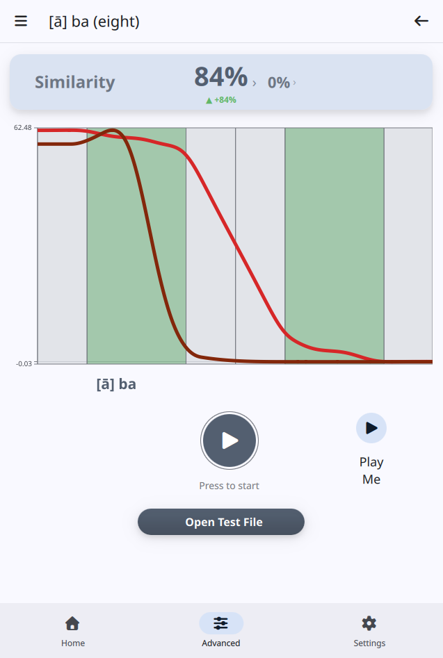

На этой странице вы можете:

- воспроизвести целевой образец,
- записать свою попытку,
- проанализировать результат,
- сравнить свой звук с целевым образцом,
- воспроизвести свою последнюю запись.

_Это самый важный экран в приложении._

### 4.5 Экран расширенного анализа

Этот экран предназначен для более детального изучения.

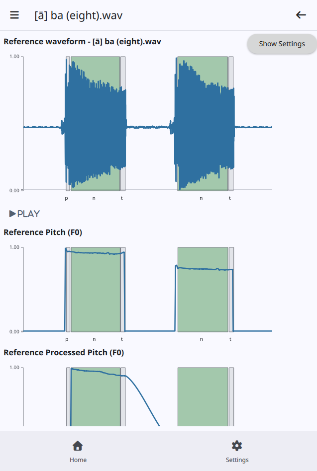

Этот экран предназначен для более глубокого анализа. Эти настройки напрямую влияют на работу анализатора сигналов и качество сопоставления произнесенной фразы с эталоном. Эти настройки очень эффективны, но при необоснованных изменениях могут привести к непредсказуемому поведению приложения.

Это полезно, когда вы хотите увидеть:

- различия в форме волны,
- кривые высоты тона,
- поведение DTW-сопоставления,
- трассы DTW,
- диагностику спектра/кепстра.

Расширенные настройки желательно изменять **только по согласованию с разработчиком**. Используйте их только после того, как вы уже получили результат и хотите понять, почему оценка была слишком высокой или низкой.

### 4.6 Экран записей

На этой странице хранятся ваши сохраненные попытки.

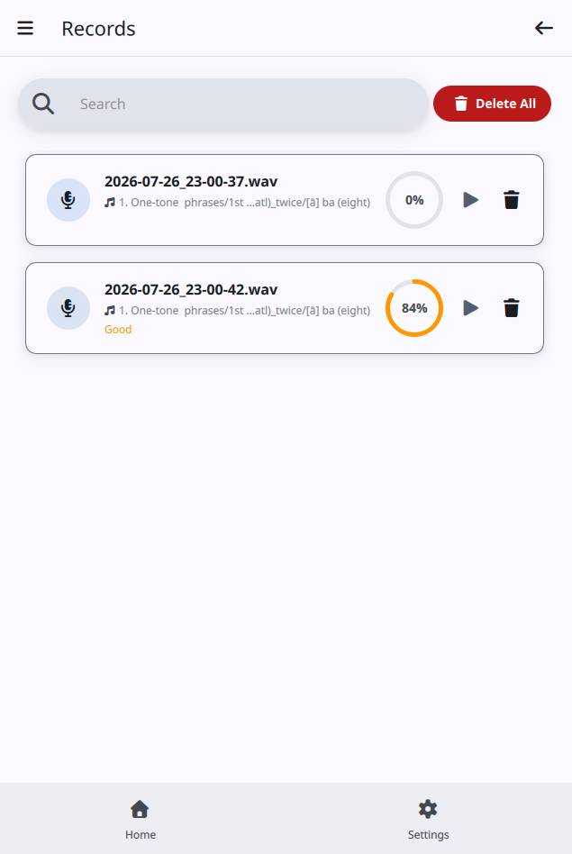

Здесь вы можете:

- просмотреть историю записей,
- проверить предыдущие результаты,
- повторно открыть запись в режиме анализа,
- удалить отдельные элементы при необходимости.

### 4.7 Экран настроек

Страница настроек управляет поведением приложения.

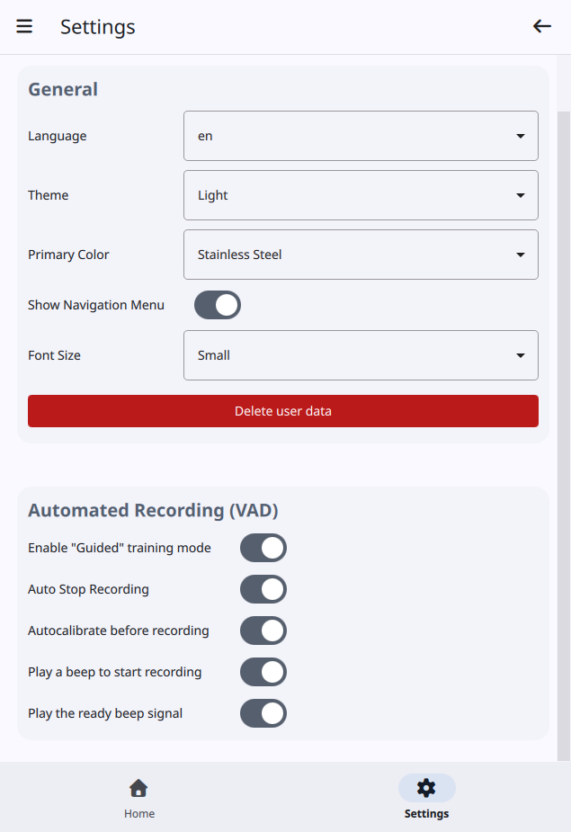

Она включает в себя:

- настройки внешнего вида,
- удаление пользовательских данных при необходимости,
- настройки навигации,
- настройки записи и VAD (Voice Activity Detector),
- подробные настройки DSP (Digital Speech Processor).

_Большинству пользователей требуется лишь небольшой набор этих элементов управления._

## 5. Режимы тренинга, доступные в приложении

IntonTrainer 2-Ch поддерживает три практических стиля тренинга. Разница заключается главным образом в том, как приложение начинает и останавливает запись во время цикла тренинга (см. скриншот: экран настроек).

### 5.1 Автоматический режим

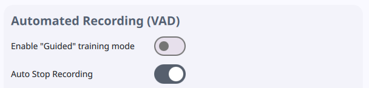

Автоматический режим - это самый простой способ тренинга.

**Как это работает:**

- приложение начинает прослушивание, как только активируется экран тренинга;
- детектор речи определяет, когда вы начинаете говорить, и осуществляет запись речи;
- запись автоматически останавливается после обнаружения тишины;
- результат обрабатывается немедленно.

**Лучше всего подходит для:**

- быстрого повторения;
- непрерывной практики;
- пользователей, которым комфортна свободная манера речи;
- пользователей, которые хотят, чтобы приложение автоматически управляло жизненным циклом записи.

### 5.2 Режим с подсказками

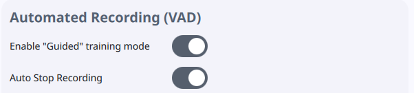

Режим с подсказками - это структурированный режим тренировки.

**Как это работает:**

1. Приложение воспроизводит эталонный аудиофайл.
2. Пользователь прослушивает его.
3. После короткой паузы приложение открывает окно прослушивания.
4. Пользователь говорит, когда готов.
5. Система записывает ответ и обрабатывает его.

**Лучше всего подходит для:**

- начинающих;
- пользователей, которые хотят больше контролировать время ответа;
- тренировочных сессий, где эталонный файл должен звучать первым каждый раз;
- ситуаций, когда пользователь хочет получить четкую последовательность «прослушивание → подготовка → речь».

Параметры времени режима с подсказками (таймаут окна прослушивания и задержка после воспроизведения) можно настроить на странице настроек в разделе записи / VAD - ищите параметры режима с подсказками.

### 5.3 Ручной режим

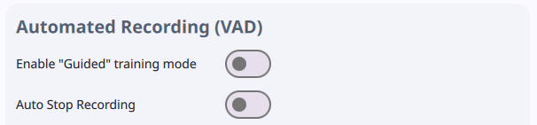

Ручной режим используется, когда VAD / автоматическое определение речи фактически отключены.

**Как это работает:**

- приложение не пытается автоматически остановить запись,
- пользователь управляет записью вручную,
- запись сохраняется после того, как пользователь ее закончит,
- результат затем анализируется обычным способом.

**Этот режим полезен, когда:**

- вы хотите полностью контролировать начало и конец записи,
- окружающая среда шумная, и автоматическое распознавание голоса ненадежно,
- вы предпочитаете целенаправленный, практический стиль обучения.

### 5.4 Различия между режимами

| Режим | Поведение | Наилучшее применение |
| --- | --- | --- |
| Автоматический режим | Запуск записи при речевой активности и предоставление системе возможности управлять полным циклом | Быстрая, непрерывная практика |
| Режим с подсказками | Сначала воспроизводится эталонный фрагмент, затем система ожидает вашего ответа в контролируемой последовательности | Структурированная практика и удобное для начинающих повторение |
| Ручной режим | Запись контролируется пользователем при отключенном VAD | Целенаправленная практика и шумная обстановка |

### 5.5 Какой режим использовать в разных случаях

**Используйте автоматический режим, когда:**

- вам нужен быстрый и непрерывный цикл тренировки,
- вам удобно говорить сразу,
- вам нужно минимальное взаимодействие с процессом записи.

**Используйте режим с подсказками, когда:**

- вы изучаете образцы шаг за шагом,
- вы хотите прослушать эталон перед ответом,
- вам нужен более стабильный ритм тренировки,
- вам нужен лучший контроль над временем ответа.

**Используйте ручной режим, когда:**

- вы хотите управлять записью вручную,
- VAD плохо работает в текущей среде,
- вы хотите тренироваться со стабильным, четким началом и остановкой.

### 5.6 Практические рекомендации

- Начните с автоматического режима, если вы уже знаете рабочий процесс и хотите максимальной скорости тренинга.
- Начните с режима с подсказками, если вы изучаете новый образец или хотите более целенаправленный цикл тренинга.
- Используйте ручной режим, когда вам нужен полный контроль, а автоматическое определение кажется ненадежным.

## 6. Показатели и индикаторы прогресса на каждом экране

Приложение предоставляет обратную связь несколькими способами. Некоторые числа описывают ваш общий прогресс, а другие показывают, как одна попытка соотносится с эталонным образцом.

### 6.1 Показатели на главном экране

Главный экран - это сводка вашего общего прогресса.

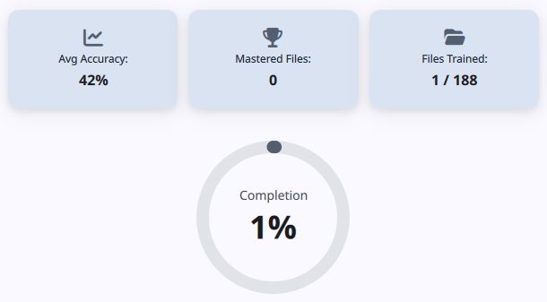

| Показатель | Значение | Как меняется в процессе прогресса |
| --- | --- | --- |
| Средняя точность | Среднее значение ваших лучших результатов по уже отработанным файлам | Увеличивается по мере повышения точности ваших повторных попыток |
| Освоенные файлы | Количество файлов, достигших высокого уровня результата, в настоящее время около 90% или выше | Растет по мере того, как вы постоянно улучшаете файл до уровня освоения |
| Обученные файлы | Количество файлов, которые были отработаны хотя бы один раз | Увеличивается каждый раз, когда вы завершаете допустимую попытку обучения |
| Завершение | Общий уровень прогресса для всего набора обучающих файлов | Повышается по мере отработки и улучшения большего количества файлов |

**На практике:**

- более высокая средняя точность означает, что вы постоянно лучше соответствуете эталону,
- больше освоенных файлов означает, что больше образцов теперь под контролем,
- растущее количество обученных файлов показывает, что ваша программа тренировок продвигается вперед.

### 6.2 Показатели категорий образцов и списка wav-файлов образцов

В окнах просмотра файлов образцов и категорий приложение отображает готовность каждого элемента.

Для карточки отдельного файла:

- карточка отображает оценку, если файл уже был отработан;
- метка статуса может быть «Отлично», «Хорошо», «Средне», «Плохо», «Неудача» или «Еще не отработан»;
- круговой индикатор прогресса отражает ваш лучший результат для этого файла.

Для карточки папки или категории:

- приложение показывает, сколько файлов внутри нее уже было отработано;
- процент завершенности папки рассчитывается на основе результатов внутри этой категории.

По мере улучшения:

- файл, который еще не был отработан, начинается без оценки;
- после успешной попытки оценка и метка обновляются;
- лучшие результаты постепенно перемещают карточку в более качественные диапазоны и увеличивают завершенность папки.

### 6.3 Показатели экрана тренировки

На экране тренировки вы видите непосредственный результат текущей попытки.

| Показатель | Значение показателя | Изменение в процессе тренинга |
| --- | --- | --- |
| Текущий показатель сходства | Ваш текущий результат в процентах | Изменения происходят каждый раз, когда новая запись сравнивается с образцом |
| Индикатор тренда | Лучше или хуже новая попытка, чем предыдущая | Стрелка вверх означает улучшение, стрелка вниз - более слабый результат, а плоская точка - отсутствие изменений |
| История результатов | Короткая последовательность ваших последних результатов | Растет по мере тренировки, при этом самый новый результат находится ближе к центру |

**Как читать эту обратную связь:**

- показатель, близкий к 100%, означает, что ваша попытка очень близка к эталону,
- тренд показывает, улучшается ли ваша производительность от одной попытки к другой,
- история результатов помогает заметить, становится ли ваша производительность более стабильной с течением времени.

_Хорошее правило - рассматривать экран тренировки как страницу «обратной связи в реальном времени», а главный экран - как страницу «долгосрочного прогресса»._

### 6.4 Показатели на экране «Записи»

На экране «Записи» сохраняются ваши завершенные попытки для последующего просмотра.

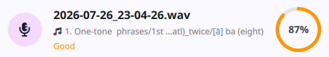

| Показатель | Значение | Как изменяется в процессе работы |
| --- | --- | --- |
| Результат записи | Оценка, присвоенная сохраненной попытке | Сохраняется вместе с этой записью в архиве |
| Эталонный образец | Образец, с которым сравнивалась запись | Не изменяется после сохранения |
| Дата / время | Время создания записи | Новые попытки появляются как новые записи в истории |

_Этот экран в основном предназначен для обзора и архивирования._ Он сохраняет результаты вашей практики, чтобы вы могли вернуться к более старым попыткам и сравнить их позже.

### 6.5 Визуальные кривые - это диагностические показатели, а не просто украшение

График на экране тренировки является частью системы обратной связи:

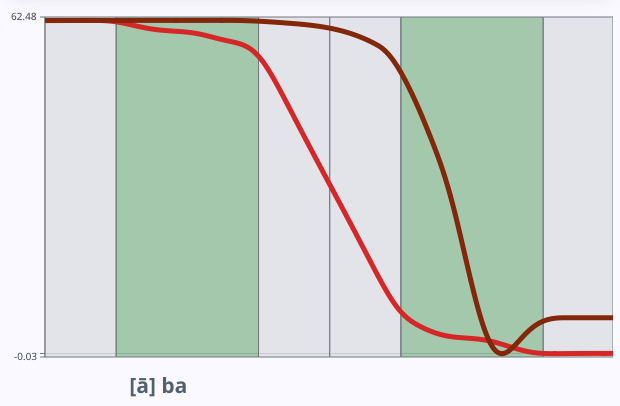

- кривая пользователя и эталонная кривая показывают, насколько форма вашей интонации соответствует модели,
- большие расхождения на графике часто соответствуют более низким показателям сходства,
- по мере повышения вашей точности кривые обычно становятся более визуально согласованными с эталоном.

Таким образом, приложение сочетает числовые показатели прогресса с визуальной обратной связью сравнения.

### 6.6 Как фиксируются результаты обучения

Приложение сохраняет ваш прогресс обучения двумя способами:

- лучший результат для каждого файла образца запоминается и отображается на карточке файла;
- завершенные попытки сохраняются в виде записей, чтобы вы могли позже просмотреть точный результат.

**Как фиксируется результат:**

- каждый раз, когда вы завершаете попытку обучения, приложение вычисляет показатель сходства;
- если этот показатель является лучшим на данный момент для этого файла, оно обновляет маркер прогресса файла;
- сама попытка при желании сохраняется на экране «Записи» для последующего просмотра;
- затем главный экран и карточки категорий используют эти зафиксированные лучшие результаты для обновления средних значений, завершения и меток качества.

**Что это означает на практике:**

- лучший результат при повторной попытке заменяет предыдущий лучший результат для этого файла;
- старые попытки остаются доступными в архиве записей;
- приложение использует фиксированный лучший результат, а не последний, для отображения вашего общего прогресса.

**Как это влияет на остальную часть приложения:**

- на главном экране обновляются средние значения и показатели завершения, используя фиксированные лучшие результаты для каждого файла;
- значения прогресса для папок и категорий пересчитываются на основе обновленных результатов файлов;
- метка карточки файла может измениться с «Хорошо» или «Средне» на «Отлично», когда ваш лучший результат улучшится;
- общее количество освоенных файлов может увеличиться, если ваш новый результат превысит порог освоения.

_Этот метод помогает отслеживать как вашу текущую производительность, так и долгосрочное улучшение._

## 7. Рекомендуемая программа тренировок

Для наилучшего результата используйте приложение в тихой обстановке, с качественным микрофоном, и придерживайтесь простого алгоритма тренировки:

1. Начните с привычного образца.
2. Внимательно прослушайте эталонную запись.
3. Говорите естественно и чётко в качественный микрофон (внешний или хороший встроенный микрофон ноутбука). Качество микрофона напрямую влияет на анализ высоты тона.
4. Дождитесь завершения записи функцией автоматической остановки, если она включена.
5. Просматривайте показатель сходства после каждой попытки.
6. Повторяйте одну и ту же фразу несколько раз, прежде чем переходить к следующей.
7. Используйте расширенный анализ только тогда, когда вам нужно более подробно изучить несоответствие.

Хорошая привычка - использовать небольшой набор образцов и тренироваться с ними многократно, а не слишком часто переключаться между множеством разных образцов.

## 8. Настройки, которые можно безопасно изменить

Это настройки, которые, как правило, безопасны и полезны для большинства пользователей.

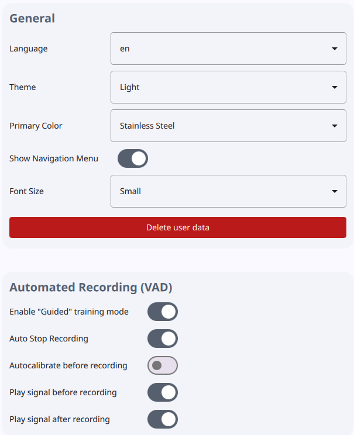

### 8.1 Язык

Измените этот параметр, если хотите, чтобы надписи в приложении давались на английском или русском языке.

### 8.2 Тема

Вы можете переключаться между светлой, темной или системной темой.

### 8.3 Основной цвет

Косметический параметр, изменяющий визуальный акцентный цвет интерфейса.

### 8.4 Отображать навигационное меню

Используйте этот вариант, если вы предпочитаете стандартную навигацию или более привычный для настольных компьютеров формат отображения.

### 8.5 Размер шрифта

Увеличьте или уменьшите размер текста в пользовательском интерфейсе, если значение по умолчанию кажется слишком маленьким или слишком большим.

### 8.6 Режим с подсказками

Если вы хотите более контролируемый цикл обучения, включите режим с подсказками.

Это обычно хороший вариант для начинающих, поскольку он разделяет:

- прослушивание эталонного материала,
- подготовку к ответу,
- произнесение ответа.

### 8.7 Автоматическая остановка записи

Это часто полезно, поскольку уменьшает необходимость вручную останавливать запись.

Рекомендуется для большинства пользователей, если вы намеренно не хотите контролировать продолжительность записи самостоятельно.

### 8.8 Автоматическая калибровка перед записью

Это практичный параметр для управления шумом микрофона.

Если вы меняете помещение, гарнитуру или микрофон, запустите калибровку снова.

### 8.9 Воспроизвести сигнал «бип» начала записи

Это сигнал-извещение для начала произношения тренировочной фразы сразу после того, как был озвучен изучаемый образец.

### 8.10 Воспроизвести «бип»-сигнал готовности

Этот сигнал извещает, что все процессы анализа завершены и на экране отобразилась соответствующая тональная кривая произнесенной фразы.

## 9. Практические советы для новых пользователей

### 9.1 Начните с простого

Не меняйте много настроек одновременно. Если результат кажется странным, сначала протестируйте одну переменную за раз.

### 9.2 Используйте качественный микрофон

Анализ высоты тона зависит от чистой записи. Предпочитайте внешний микрофон или хороший встроенный микрофон ноутбука дешёвому или шумному. Низкое качество микрофона часто выглядит в оценке как проблема произношения.

### 9.3 Предпочтительнее калибровать после изменения окружающей среды

Если вы переместили микрофон, сменили комнату или наушники, запустите калибровку снова.

### 9.4 Используйте режим с подсказками при изучении паттерна

Режим с подсказками - полезная структура для начинающих, поскольку он создает четкий цикл: слушать, готовиться, говорить, оценивать.

### 9.5 Используйте расширенный анализ только после того, как результат уже виден

Не начинайте глубокую настройку, если вы еще не знаете, какую часть результата хотите проверить.

### 9.6 Сохраняйте ту же конфигурацию комнаты и микрофона при сравнении прогресса

Последовательность делает изменения результата более значимыми.

## 10. Контрольный список для устранения неполадок

Если приложение работает не так, как ожидалось, сначала проверьте следующие пункты:

1. Убедитесь, что микрофон подключен и активен.
2. Повторите калибровку, если изменился уровень шума в помещении.
3. Убедитесь, что функция автоматической остановки записи соответствует вашему предпочтительному стилю работы.
4. Если приложение слишком часто или слишком редко обнаруживает речь, тщательно отрегулируйте метод VAD и пороговые значения.
5. Если оценка выглядит нестабильной, оставьте расширенные настройки DSP по умолчанию, если вы намеренно не исследуете выравнивание.
6. Если режим с подсказками не работает, убедитесь, что автоматическая остановка включена и что время ожидания прослушивания является разумным.
7. Если запись пропускается без предупреждения: проверьте `build/application.log` (или журнал выполнения в каталоге приложения) на наличие сообщения об отклонении DTW и рассмотрите возможность увеличения предела расстояния DTW в Настройках → Расчет DP. Также подтвердите, где хранятся записи (каталог `data/records` приложения), если вы хотите напрямую просматривать сохраненные аудиофайлы.

## 11. Краткое описание лучших практик

Для большинства пользователей наилучший подход заключается в следующем:

- использовать настройки по умолчанию,
- поддерживать стабильные условия звука и использовать качественный микрофон (внешний или хороший встроенный микрофон ноутбука),
- использовать режим с подсказками для структурированной практики,
- переходить к расширенному анализу только при наличии конкретной причины,
- избегать изменения настроек DTW и DSP, если вы намеренно не диагностируете техническую проблему.

Это делает приложение простым в использовании, предоставляя опытным пользователям полный доступ к более глубоким элементам управления анализом.

## 12. Заключительная рекомендация

Если вы новичок в **IntonTrainer 2-Ch**, сначала используйте приложение в конфигурации по умолчанию. Сосредоточьтесь на изучении рабочего процесса, прослушивании эталонных файлов, записи собственной речи и отслеживании улучшений результатов с течением времени.

Только после этого следует начать изучать расширенные элементы управления на странице настроек.

## 13. Лицензия

Собственный исходный код приложения предоставляется по [лицензии MIT](https://github.com/zhitko/inton-trainer-2/blob/main/LICENSE). Собранный исполняемый файл также включает ALGLIB под лицензией GPL, а Qt подключается динамически под LGPLv3. Полные уведомления, сведения о доступности исходного кода и инструкции по перекомпоновке Qt доступны в разделе **Лицензии открытого ПО** бокового меню.

## 14. Библиотеки сторонних разработчиков

| Библиотека | Назначение библиотеки |
| --- | --- |
| [**SPTK**](https://github.com/sp-nitech/SPTK) (Speech Signal Processing Toolkit 4.3) | Извлечение основной частоты (алгоритм RAPT), обработка аудио характеристик |
| [**ALGLIB**](https://www.alglib.net/) 4.06.0 | Сплайновое сглаживание для профилей шага и UMP |
| [**Font Awesome**](https://fontawesome.com/) (Free 7.2.0) | Шрифт иконок, используемый во всем пользовательском интерфейсе |
| [**Ten-vad**](https://github.com/TEN-framework/ten-vad) | Сохранён для оценки; в текущую версию приложения не включён |

## 15. Авторы

- **Борис Лобанов** - научная разработка - [LinkedIn](https://www.linkedin.com/in/boris-lobanov-50628384/)
- **Владимир Житко** - программная разработка - [LinkedIn](https://www.linkedin.com/in/zhitko-vladimir-92662255/)
